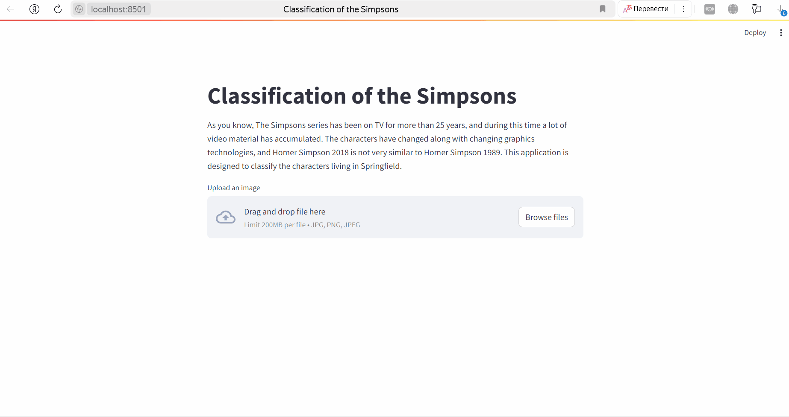

# Classification of the Simpsons
---
As you know, The Simpsons has been on TV for more than 25 years, and a lot of video material has accumulated during this time. The characters have changed along with changing graphics technologies, and Homer Simpson 2018 is not very similar to Homer Simpson 1989. This application is designed to classify the characters living in Springfield.
Link to the website - [web application](https://simpsons-classification.streamlit.app/)




The journey-springfield dataset was taken from the Journey to Springfield competition on Kaggle - [dataset](https://www.kaggle.com/competitions/journey-springfield/data)

## How to run it on your own machine
---
1. You must have python 3 installed in any version.
2. Clone this repository to yourself
   ```
   $ git clone https://github.com/MakhmudovMels/simpsons-classification.git
   ```
3. Use the cd command to navigate to the created folder
   ```
   $ cd simpsons-classification
   ```
4. Install the requirements
   ```
   $ pip install -r requirements.txt
   ```
5. Run the app
   ```
   $ streamlit run streamlit_app.py
   ```
